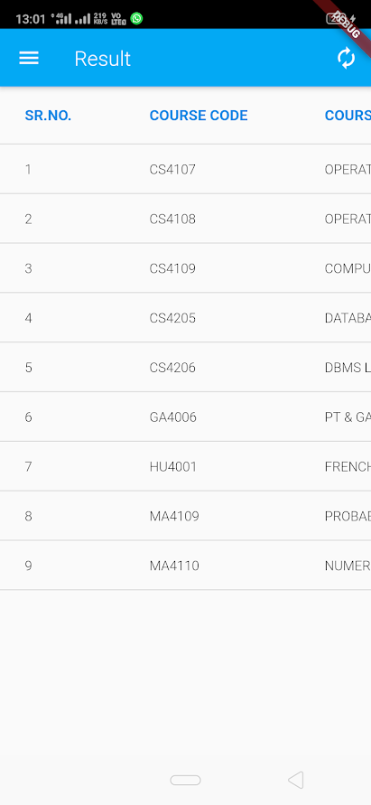

# BIT GO

BIT GO is a flutter app that tells the attendance, internal results, and final examination results. It helps the user in keeping track of attendance and marks. This app woks only for BIT Mesra students.

## Installation

Install flutter using this [tutorial](https://flutter.dev/docs/get-started/install).

Connect your android or ios phone to PC and turn on usb debugging.
You are ready to go.

## Usage

## Contributing
Pull requests are welcome. For major changes, please open an issue first to discuss what you would like to change.

